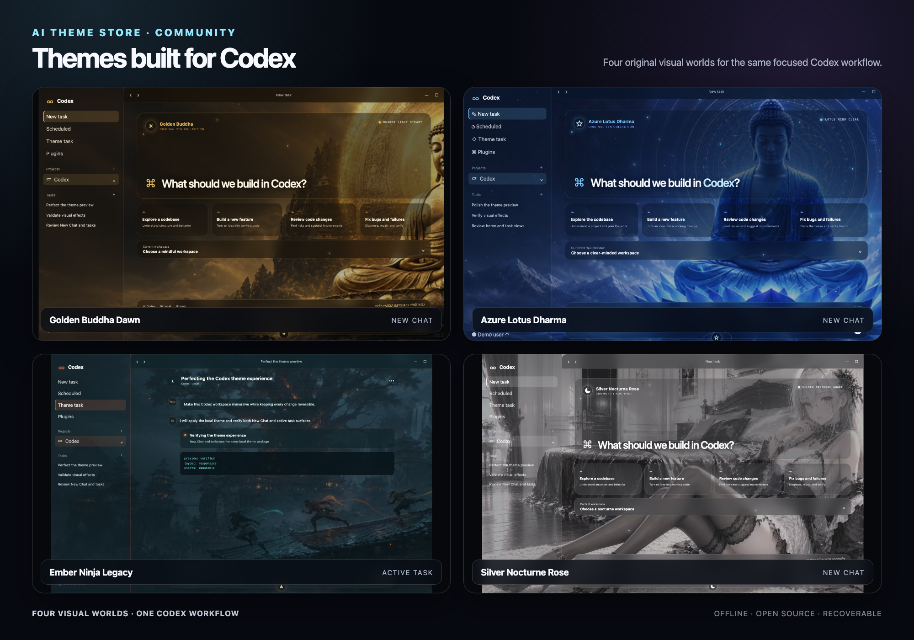

<p align="right">
  <a href="./README.md">English</a> · <strong>简体中文</strong>
</p>

# AI ThemeStore Community

一套面向 **macOS Codex Desktop** 的开源离线主题 App。它可以为 Codex
工作区加入完整的视觉主题，同时保持官方 App 完整，所有改动均可恢复。

[](https://github.com/hackergene/AI-ThemeStore-Community/releases/latest)
[](./LICENSE)
[](#隐私与安全)

> AI ThemeStore Community 是独立的非官方项目，与 OpenAI 无隶属、背书或赞助关系。

## Codex 主题效果

这张经过信息清理的高保真组合图展示了完整主题库中的四种视觉世界：
**佛陀 · 万山朝光**、**佛陀 · 青莲法界**、**Ember Ninja Legacy** 与
**银夜蔷薇**，同时覆盖 New Chat 和运行中任务，不包含任何真实账号、项目或对话数据。



忍者画面使用原创、无第三方角色的 `Ember Ninja Legacy` 素材。本仓库未包含任何
第三方角色同人图片。

## 项目包含什么

- 原生 SwiftUI App，用于浏览、应用、验证和恢复主题
- 三套内置可再分发主题：极简玻璃、赛博霓虹、粉色未来城市
- 开放的本地 `theme.json` 格式，可制作自己的 Codex 主题
- 仅绑定回环地址的主题运行时，支持事务式切换和失败回滚
- 校验官方 Codex App 及其内置 Node.js 运行时的签名
- 不包含账号、遥测、云端 Registry、远程设备或自动更新

## 适配 Codex 的实践经验

Codex 是持续演进的产品，因此稳定主题不能只是一张壁纸，也不能依赖一组脆弱的
选择器。Community 引擎基于以下实践构建：

1. **覆盖完整工作流。** New Chat 与运行中任务应使用统一视觉语言，包括任务卡、
   输入区、侧边栏和分层面板。
2. **识别真正可见的界面。** 现代 App Shell 可能同时存在隐藏层和过渡层，运行时
   应定位用户实际看到的主区域，而不是默认使用第一个匹配元素。
3. **同时保证交互和可读性。** 玻璃透明度、模糊、文字对比度、焦点状态和响应式
   布局需要作为一套系统处理。
4. **应用后必须验证。** 只有确认 New Chat 与任务页出现预期主题效果后才算切换
   成功，否则自动回滚。
5. **保持可恢复边界。** 引擎不会修改 Codex 二进制文件、`app.asar`、应用签名、
   API Key 或服务地址。

这些约束让主题与 Codex 更自然地融为一体，同时让自定义边界保持清晰、可审计、
可恢复。

## 开始使用

### 下载

从 [GitHub Releases](https://github.com/hackergene/AI-ThemeStore-Community/releases/latest)
下载最新版本。

### 从源码构建

需要 macOS 13 或更高版本、官方 Codex Desktop App，以及 Xcode Command Line Tools。

```bash
git clone https://github.com/hackergene/AI-ThemeStore-Community.git
cd AI-ThemeStore-Community
./scripts/build-app.sh
open "dist/AI ThemeStore Community.app"
```

构建脚本只生成本地 Community App，不会修改或重新签名官方 Codex App。

### 使用 App

1. 打开 AI ThemeStore Community。
2. 选择本地主题并点击“应用主题”。
3. App 会重启 Codex，并验证 New Chat 与任务页的主题状态。
4. 随时点击“恢复 Codex 外观”即可回到原生界面。

自定义主题目录：

```text
~/Library/Application Support/AIThemeStore/themes
```

每套主题是一个独立目录，包含 `theme.json` 及其引用的本地资源。字段、安全限制与
最小示例见[主题格式文档](./docs/theme-format.md)。

## 测试

```bash
./tests/run-tests.sh
```

## 隐私与安全

Community 版离线运行，不包含遥测或账号代码。调试连接仅绑定 `127.0.0.1`。
主题启用期间，本地调试端口属于敏感能力，请勿同时运行不可信的本机软件。完整边界
见 [SECURITY.md](./SECURITY.md)。

## Community 与完整版

本仓库有意保持为一套小型、可审计、离线的 Codex 主题体验。更多主题及在线浏览
体验请访问 [themestore.ai](https://themestore.ai)。

欢迎参与贡献。提交 Issue 或 Pull Request 前请阅读
[CONTRIBUTING.md](./CONTRIBUTING.md)。

## 许可证

源代码和仓库内三套原创主题采用 [MIT License](./LICENSE)。OpenAI、Codex 名称、
官方应用界面及其他第三方商标不在授权范围内，详见 [NOTICE.md](./NOTICE.md)。
